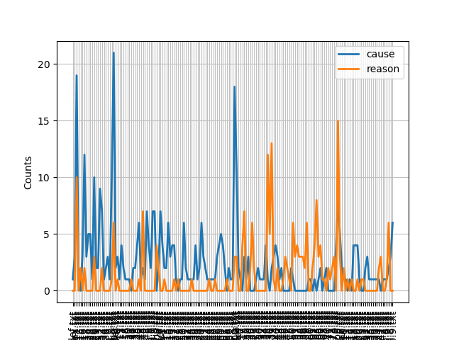
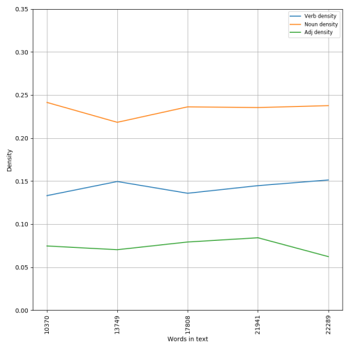

# Spinoza-NLTK-Ethics
NLTK lexical analysis of ETHICS

## 1. Software necesario (win10)

- python 3.8
- pip install -U nltk
- ejecutar 
  - import nltk
  - nltk.download() -- ALL
- pip install -U numpy
- pip install -U matplotlib
- pip install scipy

Se puede echar un vistazo a:
		
https://answers.microsoft.com/en-us/windows/forum/all/microsoft-visual-c-140/6f0726e2-6c32-4719-9fe5-aa68b5ad8e6d

https://www.scivision.dev/python-windows-visual-c-14-required/

## 2. Spinoza (ETICA)

En comparación a la Etica de Spinoza el resto de libros parecen cuentos infantiles. Fue publicada en 1677 tras la muerte del autor.

Abunda la información sobre Spinoza en internet, como es obvio. En esta pequeña disgresión lingüistica (si así puede llamarse) sobre el libro spinozista se ha tomado el texto de:

http://home.kpn.nl/rudolf.meijer/spinoza/

## 3. Ficheros de input

Se ha utilizado la versión inglesa del *site* anteriormente mencionado. Los ficheros de input (el texto) pueden encontrarse en el [directorio dat](dat)  

Solo algunas notas:

De modo general, el texto consta de 5 partes o capítulos. Cada capítulo tiene:
- prefacio
- definiciones
- axiomas
- proposiciones (enunciados y demostraciones, en algunos casos corolarios)
- apéndice

Pero no es así en todos los casos. Por ejemplo en la parte III hay axiomas y también postulados; así como un apartado "Definición de las emociones". En la parte V no hay definiciones. En la parte I no hay prefacio...

Se adjuntan los ficheros correspondientes a:

- el texto completo
- el texto separado en sus capítulos
- el texto completo separado en sus partes *euclidianas* (por ejemplo *1.prop.3.txt* es el fichero que contiene "capitulo 1. Proposición y prueba nº 3")
- las demostraciones (idem a lo anterior, para las demostraciones. Por ejemplo III.32.txt es la prueba de la Prop.32 del capitulo 3)
- las proposiciones (idem, pero para el enunciado de las proposiciones)

# NLTK

## 1. Palabras frecuentes

Se ejecuta el [script](src/spinoza.py)

También se obtienen los conteos de estos términos:

O visto de otro modo:

## 2. Dispersion de términos

También a través de la ejecución del [script](src/spinoza.py) podemos ver cómo se distribuyen ciertos términos a lo largo del texto:

Para Spinoza, dios y la naturaleza son sinónimos. El primer término se menciona al principio del tratado, sobre todo. El segundo es omnipresente.

## 3. Bigramas

Los bigramas del texto también se calculan, los mas frecuentes:

Donde se ven ciertas asociaciones curiosas: 

*pleasure_pain* (de ciertas resonancias moralizantes) 
*external_cause* (en el apologeta de la inmanencia)
*human_body* asi como *human_mind* (que tiene un fuerte sabor cartesiano)

Los menos frecuentes:

Donde resultan curiosos:

*hope_fear* (jaja, no se puede ser más determinista!!)
*desire_arising* (¿incontinencia como tendencia natural?)

## 4. Dispersión comparada

Algunos ejemplos de visualizar comparatívamente también son curiosos.
Cuanto más se habla de *god*, menos de *mind*

*Cause* aparece a lo largo de todo el libro

Y es después de los 2 primeros capítulos donde se habla de los afectos y emociones

## 5. Sinónimos o similares

Si ejecutamos ahora el [script](src/etic_sin_sim.py)

Se muestran cosas como:

 - no hay contextos comunes para love y ambition (cosas que, por otro lado, son muy parecidas)

 - no hay power en dios

***************** Similar: God **********************************
it nature which the things man reason he substance himself love pain
thought knowledge them eternity this virtue hatred one
***************************************************

 - La potencia es algo asociado a lo natural (una especie de segundad acepción de dios)

 ***************** Similar: power **********************************
nature body mind and desire essence existence idea knowledge love
pleasure cause causes part faculty emotion thing intellect imagination
emotions

Si modificamos la ruta de input para ejecutar sobre (por ejemplo) las proposiciones:

***************** Similar: reason **********************************
pleasure god knowledge what ideas activity pain character eternity

- se exhibe el propósito del libro: fundamentar las razones de lo placentero (y de lo reprobable)

## 6. Diversidad léxica 

Se puede visualizar la diversidad léxica del texto ejectuando el [script](src/etic_div_lexi.py)

Se cambia el input para obtener los cálculos tambié para las proposiciones y para las demostraciones, así como para el texto entero:

Este es el diagrama para todo el texto:

Y para las partes del libro:

El capítulo 2 es el más rico en léxico, mientras que la parte 4ª tiene mas términos redundantes

Si se comparan los cálculos relativos a las proposiciones y demostraciones, no se observan grandes diferencias, pese a ser mayor la correspondiente a las demostraciones. Es tambien muy similar a la encontrada para el texto completo.

## 7. Densidad léxica 

Se ejecuta el [script](src/etic_dens_adj.py)

Tambien hay un script para [el caso de los adverbios](src/etic_dens_adv.py)

La densidad léxica:

Parece que nombre y adjetivos siguen un patrón completamente "paralelo". Igual que verbos y adverbios:

El exámen por capítulos es el siguiente:

## 8. Parts of speech
